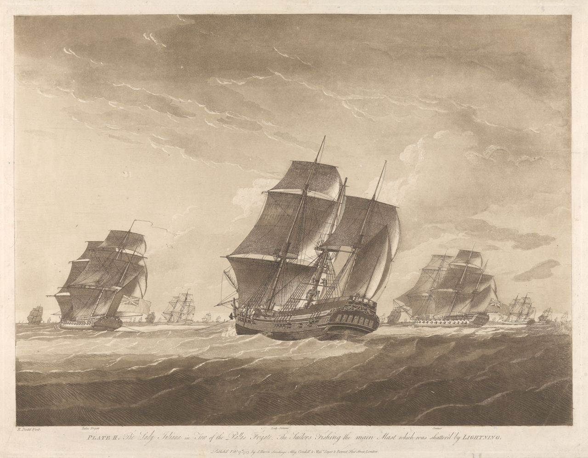
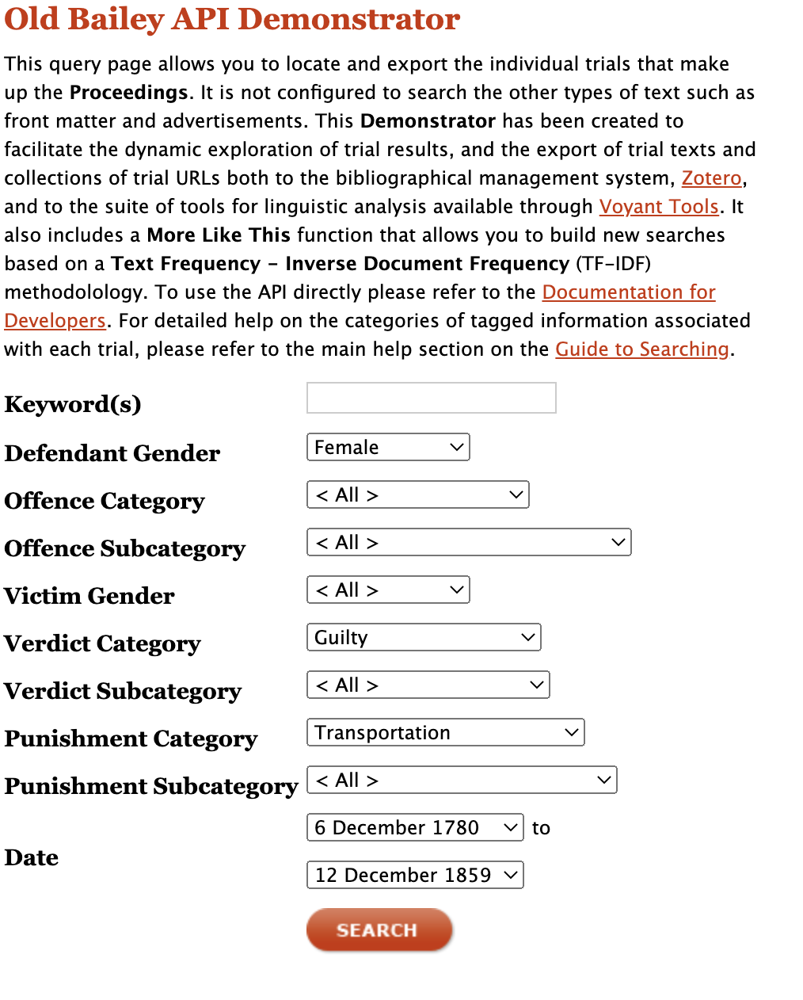
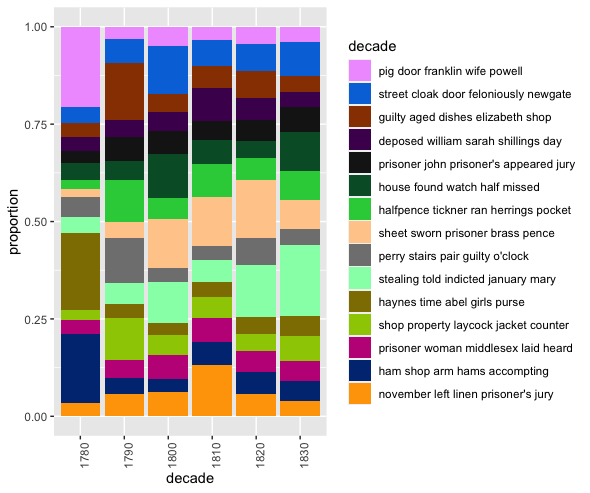
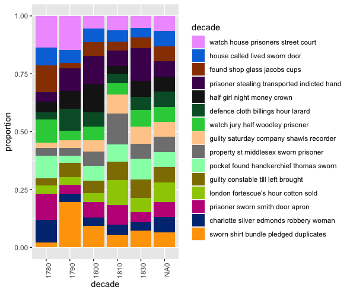
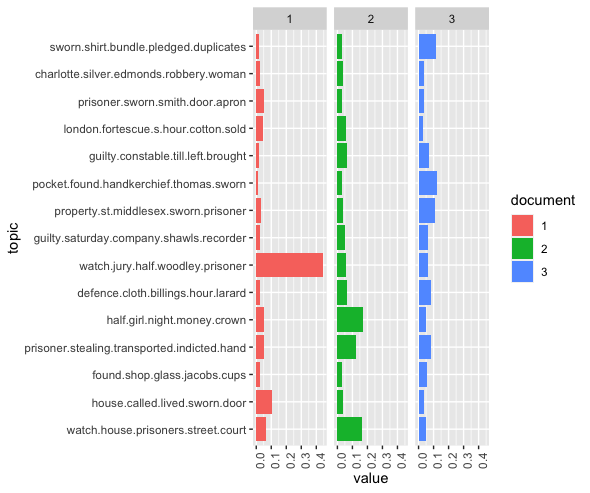

## Results 

Date: June 17th, 2022

Name: Mackenzie Stack

&emsp;Between 1787 and 1868, 1620,000 convicted prisoners from Britain and Ireland were transported to Australia[^1]. 24,0000 of the prisoners were women. While Britain's prisons were maxing out capacities and public approval of the death penalty tumbled, sentencing convicted criminals to live in Australia seemed like a suitable punishment [^2]. Transportation not only complimented British colonial ambitions but contributed to solving penal capacity problems back home. Generally, images of male prisoners ripe with labor potential are conjured when considering transportation sentences. Not often is the role of women prisoners, who made up one-sixth of transported convictions, considered[^3]. The role of women prisoners in Australian colonies is tragically overlooked; literature often paints an image of low-class prostitutes whose destiny was spelled out before boarding the Australian-bound ships. One ship, the lady's only ship, is famously dubbed "the floating brothel."

[^4]

&emsp;Using the Old Bailey API [^5], my goal is to abstract trial information from convictions between the 1780s and 1850s that resulted in sentences of transportation to compare with abstracted data of trials resulting in corporal punishment. 

&emsp;As the death penalty was still a valid legal punishment, what crimes warranted women to be sentenced to "transportation" over more accessible alternatives such as "private whipping"? As it turns out, petty theft comprises most female offender crimes resulting in transportation. In many cases, theft of household items such as linens could lead to transportation to Australia. In reviewing trials with corporal punishment sentences, it's apparent that petty theft also made up most cases [^6]. So, what made the difference? Why were some women "transported" for the same crimes as women who were comparatively let off? 

&emsp;First, I begin by determining what data I wanted from the Old Bailey API. I knew I wanted the complete trial text for specific cases that fell within the 1780s and 1850s that resulted in transportation and corporal punishments. 

&emsp;Next, I sifted through the API documentation to determine an appropriate request URL. I needed it to return the entire trial text. I selected the most appropriate way to meet my data needs was to pass trial IDs. 

&emsp;Using instructions from the API tutorial, insight gained from the python tutorial, and a very helpful tutorial by Nic Fox[^7], I wrote a python file that makes calls to Old Baileys API using the trial IDs, parses the XML files, and creates a data frame for the information. I then exported the data frame to CSV files for analysis. I then repeated this step for the corporal punishment trial ids. 

Check out API code here :[API Code](https://github.com/mackenziebstack/DH-Exploration-Exercise/blob/0228308cb597d90cfe8d3cb62107815b48c99495/api_data/getTransData.py)

&emsp;Next, I begin topic modeling while following steps from the "Cleaning and manipulating data" tutorial and the "Topic models tutorial." 

I made the following topic models with this code:[Topic Models](https://github.com/mackenziebstack/DH-Exploration-Exercise/blob/0228308cb597d90cfe8d3cb62107815b48c99495/transportedConvicts-r/transportedConvictsTopics.R)

The visualization outputs:

&emsp;The topic models demonstrate that despite starkly different sentencing, the trial documents reveal similar patterns between women who were sentenced to "transportation" and women who were sentenced to "corporal punishment." While not a statistically significant difference, the similarities only demonstrate that further analysis is needed. If time permits it in the future, I would like to conduct further research by parsing for women's employment before the sentencing, the geographic areas where the crimes took place, and a more detailed dive into the specifics of petty theft. It's difficult to understand how stealing a handkerchief leads to the destruction of families and the banishment of only some women to terrible conditions, I look forward to further research.

citations:

[^1]:The National Archives. “Transportation to Australia: The National Archives.” Archives Media Player. The National Archives, November 3, 2014. https://media.nationalarchives.gov.uk/index.php/transportation-to-australia/. 

[^2]:Sturma, Michael. “Eye of the Beholder: The Stereotype of Women Convicts, 1788-1852.” Labour History, no. 34 (1978): 3–10. https://doi.org/10.2307/27508305.

[^3]:Sturma, Michael. “Eye of the Beholder: The Stereotype of Women Convicts, 1788-1852.” Labour History, no. 34 (1978): 3–10. https://doi.org/10.2307/27508305.

[^4]:Harris, John. “The Lady Juliana in Tow of the Pallas Frigate.” Plate II. The Lady Juliana in tow of the Pallas Frigate. The Sailors Fishing the main Mast which was shatter'd by Lightning | Royal Museums Greenwich. Accessed June 18, 2022. https://www.rmg.co.uk/collections/objects/rmgc-object-148379. 

[^5]:Tim Hitchcock, Robert Shoemaker, Clive Emsley, Sharon Howard and Jamie McLaughlin, et al., The Old Bailey Proceedings Online, 1674-1913 (www.oldbaileyonline.org, version 7.0, 24 March 2012).

[^6]:Tim Hitchcock, Robert Shoemaker, Clive Emsley, Sharon Howard and Jamie McLaughlin, et al., The Old Bailey Proceedings Online, 1674-1913 (www.oldbaileyonline.org, version 7.0, 24 March 2012).

[^7]:Fox, Nic. “How to Get Data from an API &amp; Process XML in Python.” DEV Community. DEV Community, July 5, 2020. https://dev.to/nicfoxds/how-to-get-data-from-an-api-process-xml-in-python-4c1. 

